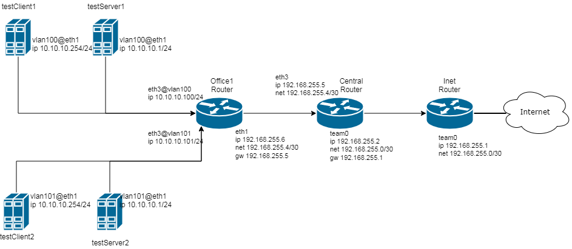

# VLAN

[схема сети](https://www.draw.io/?lightbox=1&highlight=0000ff&edit=_blank&layers=1&nav=1#R7Vzbkto4EP0aHoey5Bt%2BDJOZJFXZDRVqd5N92RK2ACXGYmxx269fyZaxZRnmEsCGdSqVoJYsS336tKRWQ8%2B8X2w%2FxGg5%2F40GOOxBI9j2zPc9CKFt8n%2BFYJcJHA9mgllMgkwECsGY%2FIul0JDSFQlwojRklIaMLFWhT6MI%2B0yRoTimG7XZlIbqW5dohjXB2EehLv2LBGwupcDxioqPmMzm8tUD6GYVE%2BT%2FnMV0Fcn39aA5Tf9k1QuU9yUnmsxRQDclkfnQM%2B9jSln2abG9x6FQba627LnHA7X7ccc4Yi96wHeR406mg2lgQtOY3gE762KNwpVUxqeI4TjCTI6Y7XIt8a44ILww5NNYCqEf0hXvebiZE4bHS%2BQL4YabCJfN2SLkJcA%2FpgrCYghG9nCmA1Hw6YL4eQWL6c89AOLBKY3YI1qQUNjVnzgOUISkWBoR4Coc6lqQilnjmOFtSSS18gHTBWbxjjfJTdjwJETShE3XysqbkkHkMM7LtiBlSNrgbN93gQP%2FIKGohyWMZ18H8O9Pq4BtRuPNj9Xm9%2BHd3mZKCATcbGWRxmxOZzRC4UMhrai6aPOZ0qVU6g%2FM2E6qD60YVbHCW8K%2BlT5%2FF131bVl6v5U9p4VdqTDCMeHzxnEui7gOvpULpZ5EsegqLe3KpWpnBwFO6Cr2cxJXbduSJGUonmF2RNOyM6Hdo7YS4xAxsladxq%2FgfnDIJTpqRpCTb7GdCWfc90ni0z4Hnusrkf%2BrmAYome9tYkrC8J6GNE57Mw3TGXjunn2lGunIqrwUhBO8Itx9fkYTHI5oQhihEa%2BbUMbootTgXUhmooIJ63upH7gc64FdZX1eLrHeHeikzxe8k4Jv61iXCR%2FRCKu4hkL9w%2F0SlGMnGybc7tkjEe%2BXzAreibWyaMElpXod5hcCUVC9DypkN8EF6T7Q6X5wvTsd1%2BWjI0r4YEvriWH0DcP0TOjZhjWAiplZwO57tusNbGhZjs2bqP1nU5BdVixqP8Y3ephB52Eu6WE8tzkPU7%2BtOO5lum1Fxc8c2zEcdTU50y6%2FrTg25I73l%2BG9O%2FAa4%2F1qCEYjj34Zf%2F3xhL5%2FnBL6bXIHBk3yvuD691LN1fG%2B5kRxcA%2FfEt6%2F%2BUSR4HgteM%2F3kVGA4uCfOU2Yiu5S7FBw%2FLDmikxa5hKQLPk4ytwWd18hifhL8xjSUVN4BdWh6yhUh45OdcvUqe7Acy3xpob5l%2BmU%2BJhPxPiaufGqDfDJVsBVMZJHhjKgUqQpuorHggRB6k3qwkSqhzkFHA6wVM9bB0dNIAeeLZCjx9juhV9C%2FEknFFqfcDycmfh08%2BjsQ6etQUc%2FEDGcsPuQ8FmCG0YCuuoOhbvnZpEw9S3qpzQOffs%2By6vuFi%2FIiuH4j90kDvBq%2BPTHxho9PCEL3ukrSO6rArJWUHCeVuL2It1E3yXpPvAdbwDAcltU5u4t70Q0fnsvmM3NvCc%2Bu6wz9QVcnA5UlbZg7GQpqjzYB86gD22b72CvdCYZNctT4evuo3Air5rPyTkd4ilrntEurMR9bJ3RANRQ2joXpb3zUJphtDBab6wa7cDt0M7oaHdwIbUsp2%2FXEA%2FWEG%2Ff8uTUy3necS81WPg%2F515pPnWjU2XJEkVvH%2FFsc8TvZV2rryuOop1DSc%2BrwHiJQ6nLDMkDgad3J%2FqxtKWh3IMIPBtpzYMmzyZvwJPf6P4aNk7LT05Xu%2FHRlhHnWmdyopNTk8tI%2BdTaLSPPLyOOrQalDy0jznkOhLU3gs0mGF7fjWC9EvVlqkU3gseG3N0Inu1G0KoEfy55I1gPuQ5xY1Q3foHq%2FSLhMGO7d1m2m9fH9rpIfsf2U7IduqbCdjvP%2FGqM7XbH9lOw3bo%2Btlsd28%2B%2BtqsJDI2zXc8uKfIXdPRv5868mnblgMvdmdcCoWfaCSDGKbFuGQjLVHe7DmwYiPqMngyIW87osaC6EblkRk8tEPqV8zpEETCMnmWUQ5FFtCgL8vGVP%2F0LRdTkEVovwOwU%2BjNBJSMq%2F9pOSX%2Fema7s63O29XvD1ykQXFJ9lmO2TH362SdTH2ir%2Fakrmm3p%2FL2sAvXt5OsU2Kj9Na%2B%2Butz71txCpFl01nOXDuXgfu57jof%2BW3vtUjFNMZHUOLv7CQjsyjV37c8f1KWr5V8rOn0Qo%2B0XqW8iz3PpF1dDHtCR5yB5LNOqTTqrW3usV9OHF4sfjMm%2BEl78KI%2F58B8%3D)


в Office1 в тестовой подсети появляется сервера с доп интерфесами и адресами  
в internal сети testLAN  
- testClient1 - 10.10.10.254  
- testClient2 - 10.10.10.254  
- testServer1- 10.10.10.1  
- testServer2- 10.10.10.1  

равести вланами  
testClient1 <-> testServer1  
testClient2 <-> testServer2  

между centralRouter и inetRouter  
"пробросить" 2 линка (общая inernal сеть) и объединить их в бонд  

## TEAMING

[ansible](teaming.yml)

Машины inetRouter centralRouter настраиваются ансиблом с помощью темплейтов с настройками интерфейсов

```bash
DEVICE=team0
IPADDR={{ item.ip }}
NETMASK=255.255.255.252
ONBOOT=yes
NM_CONTROLLED=no
USERCTL=no
BOOTPROTO=none
DEVICETYPE="Team"
TEAM_CONFIG='{ "runner" : { "name" : "activebackup", "hwaddr_policy" : "by_active" }, "link_watch": { "name" : "ethtool" } }'
```

в результате получаю устойчивую к отключению одного из физических интерфейсов связь(отключать нужно с обоих сторон одновременно)

## VLAN

[ansible](vlan.yml)

VLAN на всех машинах настраиваются через модуль ансибла nmcli

```yaml
    - name: config VLAN
      nmcli: 
        type: vlan
        conn_name: "{{ item.conn_name }}"
        ip4: "{{ item.ip4 }}"
        vlanid: "{{ item.vlanid }}"
        ifname: "{{ item.ifname }}"
        vlandev: "{{ item.vlandev }}"
        autoconnect: yes
        state: present
      with_items:
          - { conn_name: "vlan100", ip4: "10.10.10.100/24", vlanid: "100", ifname: "vlan100", vlandev: "eth2" }
          - { conn_name: "vlan101", ip4: "10.10.10.101/24", vlanid: "101", ifname: "vlan101", vlandev: "eth2" }

```

Таким образом получаются две изолированные подсети в одном физическом интерфейсе


